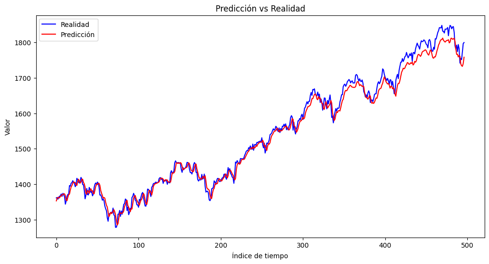

# Informe de salida

## Resumen Ejecutivo

Este informe describe los resultados del proyecto de machine learning y presenta los principales logros y lecciones aprendidas durante el proceso.

## Resultados del proyecto

- Para el presente proyecto se logro obtener un modelo que permite realizar predicciones que permitiran tomar decisiones en el futuro de esta manera se puede tomar decisiones de una manera mas acertada.
- Comparando los 3 modelos que se usaron para el proyecto se pudo obtener sus metricas que establecen que el RNN logra un mejor desempeño con este conjunto de datos.
- Un modelo y los hiperparametros que permiten tener unas metricas muy buenas se pueden desplegar con un servidor y hacer consultas que permitan predecir valores a utilizar por alguien externo.

### **Entendimiento del Negocio y Carga de Datos:**

**Logros:** Definición clara del problema y los beneficiarios del proyecto, especificación del alcance y obtención de los datos históricos del S&P 500.
**Entregables:** Marco del proyecto, trasfondo del negocio, descripción del conjunto de datos, y código para la adquisición y carga de datos.

### **Entendimiento y Preparación de los Datos:**

**Logros:** Análisis exploratorio de los datos, identificación y manejo de datos faltantes, conversión de formatos incorrectos, y análisis de correlación entre variables.
**Entregables:** Informes de calidad de datos, análisis descriptivo de variables, y limpieza de datos.

### **Diseño e Implementación Experimental:**

**Logros:** Selección de modelos (LSTM, GRU, SimpleRNN), diseño del experimento, partición de los datos, y ajuste de hiperparámetros mediante grid search.
**Entregables:** Diseño de la arquitectura de los modelos, implementación del código de entrenamiento, y selección del mejor modelo basado en métricas de rendimiento.

### **Entrenamiento y Validación:**

**Logros:** Entrenamiento de los modelos, evaluación de las métricas (MAE y MSE), y selección del modelo SimpleRNN por su mejor desempeño.
**Entregables:** Modelos entrenados, resultados de las métricas de rendimiento, y análisis comparativo de los modelos.

- Evaluación del modelo final y comparación con el modelo base.

| Name             | MSE                | MAE                |
|------------------|--------------------|--------------------|
| GRU_model        | 0.035650983452796936 | 0.18458795547485352 |
| best_model       | 0.002114337868988514 | 0.041881900280714035 |
| LSTM_model       | 0.03753206878900528  | 0.18939462304115295 |
| SimpleRNN_model  | 0.034011974930763245 | 0.18042214214801788 |

- Descripción de los resultados y su relevancia para el negocio.

### **Resultados:**

**Precisión del Modelo:** El modelo SimpleRNN muestra una precisión adecuada en la predicción de los valores del índice S&P 500, con un MSE de 0.002114337868988514 y un MAE de 0.041881900280714035 en el conjunto de prueba.

**Patrones Identificados:** La capacidad del modelo para capturar patrones temporales y hacer predicciones diarias precisas.

### **Relevancia para el Negocio:**

**Mejora en la Toma de Decisiones:** La herramienta proporciona predicciones precisas que ayudan a los inversores a tomar decisiones más informadas, optimizando estrategias de compra y venta.
**Reducción de la Incertidumbre:** Al proporcionar una mayor claridad sobre las posibles tendencias del S&P 500, se reduce la incertidumbre del mercado.

## Lecciones aprendidas

- La limpieza de los datos fue un factor fundamental, debido a la manera en que venian los datos se tuvieron que tomar decisiones con diferentes franjas de tiempor para encontrar el ideal.
- Cuando se tienen conjuntos de datos compuestos por series de datos las redes neuronales recurrentes tienen un desempeño bastante bueno a comparacion de otros metodos.
- En las series de tiempo se deben tener en cuenta los outliers, los datos de entrada y los cambios de los datos.

## Impacto del proyecto

- Descripción del impacto del modelo en el negocio o en la industria.
- Identificación de las áreas de mejora y oportunidades de desarrollo futuras.

## Conclusiones

- Resumen de los resultados y principales logros del proyecto.
- Conclusiones finales y recomendaciones para futuros proyectos.

## Agradecimientos

- Agradecimientos al equipo de trabajo y a los colaboradores que hicieron posible este proyecto.
- Agradecimientos especiales a la Universidad Nacional de Colombia y en especifico a la oferta del curso "Metodologías Ágiles para el Desarrollo de Aplicaciones con Machine Learning" impartido por el profesor Jorge Eliécer Camargo Mendoza.
