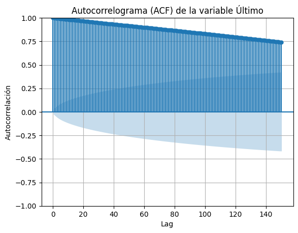

# Reporte de Datos

Este documento contiene los resultados del análisis exploratorio de datos.

## Resumen general de los datos

En esta sección se presenta un resumen general de los datos. Se describe el número total de observaciones, variables, el tipo de variables, la presencia de valores faltantes y la distribución de las variables.

## Resumen de calidad de los datos

Tal como se abordo en la definicion de los datos dado que habian valores faltantes en 4 de las columnas porlo que fue necesario hacer un preprocesamiento que permitiera trabajar de una manera correcta para esto se aplicaron las transformaciones habladas anteriormente y de esta manera se pudo obtener datos de una buena calidad.

## Variable objetivo

El conjunto de datos tiene una variable a estimar y es la variable continua objetivo "Último" la cual trae informacion del comportamiento del indice al momento del cierre del mercado de valores. En la imagen a continuacion se puede ver el comportamiento general de la variable "ultimo" ya que podemos ver en general cual fue el comportamiento del indice a lo largo de la historia y asi estudiarla para el presente modelo, de esta manera se pudo conocer que no se tiene variaciones tan significativas pero con una tendencia al comportamiento positivo.

## Variables individuales

En los graficos msotrados se ve una relacion directa entre las diferentes variables, esto se debe a que el precio del indice S&P 500 de un dia en especifico està muy ligado a su comportamiento durante ese dia, lo cual muestra una relacion fuerte. Por esta razon, estas variables seran tenidas en cuenta ya que el conjunto de estas demuestra la variabilidad que tuvo durante un dia el precio del indice y puede ayudar al modelo a dar sugerencias de inversion, esto serà util a la hora de determinar los dias anteriores a tener en cuenta para poder predecir un comportamiento futuro.

## Ranking de variables

A continuacion se visualizan los comportamientos de los datos maximos y minimos asi como de la apertura y cierre y la manera de comportarse en diferentes periodos de tiempo lo cula permite visualizar mejor las variables y los cambios que presentan

## Relación entre variables explicativas y variable objetivo

EL anterior grafico muestra una correlacion alta del precio de la acciòn con el comportamiento en dias anteriores, incluso hasta 120 rezagos o dias anteriores tienen una correlacion suerior al 75%, sin embargo entre mas rezagos se tengan en cuenta mayor cantidad de variables se tendran que no seran del todo representativas del precio actual, por lo cual se tendran en cuenta solo los rezagos mas significativos con una correlacion superior al 90%, 30 rezagos o el comportamiento del indice en el ultimo mes.
